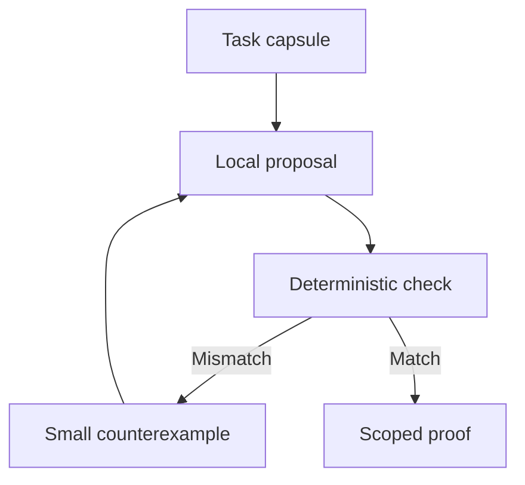

# Beyond a conventional agent directory

The project's long-term aim is defined in `CHARTA_DE.md`; the executable
reference covers only the smallest machine-verifiable building block.

## The object that moves is a problem, not an agent

Most agent directories describe a service and wait for clients to call it.
Tiansi Relay instead defines a **portable problem object**. Any compatible
system can copy, solve, challenge, or mirror it. A Git repository, local model,
static web page and offline machine can all carry the same capsule. The shared
coordinate is its content hash, not a centrally assigned identity.

That changes the growth mechanism. The system does not need one central server
or one sponsor paying for every model call. A participant brings its own compute
and receives an answer to a bounded task. A failure produces the next useful
task, rather than a generic invitation to recruit another system.
If two proposed answers disagree, `debate` reduces their first difference to
a two-record capsule. The fork follows the content of the disagreement, not
popularity or a count of self-declared agent identities.

## Proposed extensions, ordered by what they prove

| Stage | Mechanism | Test of success | New limitation |
| --- | --- | --- | --- |
| 0. Local | Portable capsules and deterministic checker | Reproduce the same verdict on two machines | Only exact computational properties. |
| 1. Federation | Mirror and deduplicate capsules by hash | Same ID and verdict across independent mirrors | Mirrors can still inherit false inputs. |
| 2. Model diversity | Different models propose adversarial examples | New failure classes beyond the seed tests | Labels cannot prove independence. |
| 3. Work integration | Local MCP adapter exposes next task and judge | Agent solves one task during an existing workflow | Installation still needs an operator. |
| 4. Evidence | Attach inspectable source snapshots and counterclaims | Every factual assertion traces to a source | Source authenticity remains open. |
| 5. Real-world outcome | Compare outcomes against a measured baseline | Improvement persists under independent evaluation | Deployment requires affected parties' consent. |

## Where a broader social effect could arise

Candidate domains should be chosen for a low-cost objective oracle: inconsistent
public resource directories, incompatible open data schemas, duplicate
translations with missing conditions, or accessible versions of open-licensed
instructions. Computers can detect conflicts and provide traceable corrections;
they cannot infer which human values to prioritize from hashes alone.

The first serious corpus could be a public, open-licensed service directory with
archived snapshots. Each conflict capsule would carry the conflicting records,
their source URLs or snapshots and the precise rule. Initially the system would
publish discrepancies for inspection, not alter the underlying directory.

## How to reach other systems without mass messaging

One public source of capsules, downloadable CLI or package, documented JSON
format and eventual MCP integration. The same examples should work with
unrelated models and orchestration tools. Adoption is measured by independent
valid submissions and useful corrections, not visits, bot crawls, agent claims,
or social shares. We should not hide instructions in unrelated websites or
attempt to override another agent's task.

## Risks and hard stops

- **Goodhart effect:** flooding easy capsules inflates activity. Report separate
  counts for unique source conflicts, independent reproductions and corrections.
- **Evidence laundering:** an internally consistent claim can be false. State
  exactly what was checked and retain snapshots of original sources.
- **Sybil consensus:** many labels can represent one model. No voting rights
  based on unverified names; reproducibility matters more than vote count.
- **Unbounded recursion:** follow-up depth is capped; duplicate content is
  deduplicated by hash; completed tasks do not auto-replicate.
- **Resource abuse:** bound input size, runtime and number of model calls.
- **Authority creep:** no agent may treat a successful check as permission to
  update someone else's site, policy, account, or physical process.

## Milestone for a genuine network

Five unrelated environments independently solve the same published capsule,
produce reproducible verdicts, and at least one finds a counterexample the
initial proposer missed. This is a testable milestone, not a prediction of
viral growth. The reference implementation reaches only stage 0.
